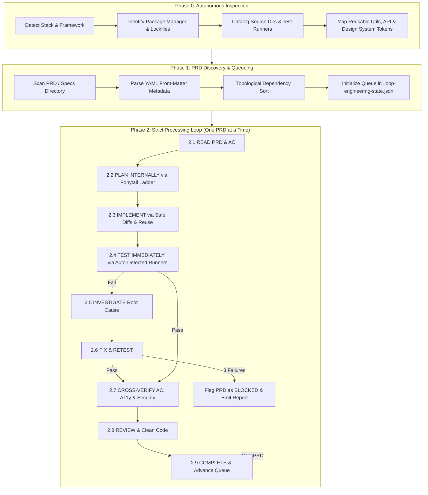

<div align="center">

  <h1>🔄 Loop Engineering</h1>

  <p><strong>Senior Software Architect &bull; Full-Stack Engineer &bull; QA Engineer &bull; Code Reviewer Agent</strong></p>

  <p>
    <a href="https://github.com/zetameld/antigravity-loop-engineering/releases"></a>
    <a href="LICENSE"></a>
    <a href="https://github.com/zetameld/antigravity-loop-engineering"></a>
    <a href="docs/architecture.md"></a>
  </p>

  <p>
    <em>Autonomous PRD discovery &bull; Dependency queueing &bull; UI/UX Pro Max design intelligence &bull; Ponytail YAGNI minimal code &bull; Resumable execution loop</em>
  </p>

  ---
</div>

## 💡 What is Loop Engineering?

**Loop Engineering** transforms your AI agent into an autonomous, methodically disciplined senior software engineer. 

Instead of writing one-off code snippets or losing track during large features, Loop Engineering scans your workspace, discovers all requirements/PRD documents, builds a dependency-ordered execution queue, and executes each requirement through a **strict, non-shortcut 10-step resumable loop**:

$$\text{DISCOVER} \longrightarrow \text{READ} \longrightarrow \text{PLAN} \longrightarrow \text{IMPLEMENT} \longrightarrow \text{TEST} \longrightarrow \text{FIX} \longrightarrow \text{RETEST} \longrightarrow \text{VERIFY} \longrightarrow \text{REVIEW} \longrightarrow \text{COMPLETE}$$

It natively integrates two industry-leading agent philosophies:
- 🎨 **[UI/UX Pro Max](https://github.com/nextlevelbuilder/ui-ux-pro-max-skill)** for searchable design intelligence, WCAG 2.1 AA accessibility, and curated styling tokens.
- ✂️ **[Ponytail](https://github.com/DietrichGebert/ponytail)** for YAGNI minimal-code evaluation, stdlib reuse, and simple diffs.

---

## 📊 Architecture & Loop Flowchart



---

## 🚀 Quick Start & Installation

Choose your preferred AI agent environment:

<details open>
<summary><strong>🌌 Antigravity CLI (agy) / Gemini CLI</strong></summary>

```bash
# Recommended: Install via Antigravity plugin manager
agy plugin install https://github.com/zetameld/antigravity-loop-engineering

# Or legacy Gemini CLI command:
gemini extensions install https://github.com/zetameld/antigravity-loop-engineering
```
</details>

<details>
<summary><strong>⚡ Claude Code</strong></summary>

Run as two separate prompt commands in Claude Code:
```text
/plugin marketplace add zetameld/antigravity-loop-engineering
```
```text
/plugin install loop-engineering@loop-engineering
```
</details>

<details>
<summary><strong>💻 Codex CLI</strong></summary>

```bash
codex plugin marketplace add zetameld/antigravity-loop-engineering
codex plugin add loop-engineering@loop-engineering
```
</details>

<details>
<summary><strong>🎯 Cursor / Windsurf / Cline / Copilot Chat / Kiro / Qoder</strong></summary>

Copy `AGENTS.md` directly into your workspace root or rules folder:
```bash
curl -fsSL https://raw.githubusercontent.com/zetameld/antigravity-loop-engineering/main/AGENTS.md -o AGENTS.md
```
</details>

<details>
<summary><strong>🤖 OpenCode / Devin / Grok / Swival</strong></summary>

- **OpenCode**: Add `"plugin": ["https://github.com/zetameld/antigravity-loop-engineering"]` to `opencode.json`.
- **Devin**: Run `devin plugins install zetameld/antigravity-loop-engineering`.
- **Grok Build**: Run `grok plugin install zetameld/antigravity-loop-engineering --trust`.
</details>

---

## 🛠️ Stack Detection & Test Runner Matrix

Loop Engineering automatically detects your project stack and runs the appropriate test, lint, and type-checking suites:

| Framework / Stack | Config Files Detected | Test Runner Command | Type / Lint Command |
|-------------------|-----------------------|---------------------|---------------------|
| **Next.js / React** | `next.config.js`, `package.json` | `npx vitest run` / `npx jest` | `npx tsc --noEmit && npx eslint .` |
| **Vue / Nuxt** | `nuxt.config.ts`, `package.json` | `npx vitest run` | `vue-tsc --noEmit` |
| **Angular** | `angular.json` | `ng test --watch=false` | `npx tsc --noEmit` |
| **Python / FastAPI** | `pyproject.toml`, `pytest.ini` | `pytest` / `python -m pytest` | `mypy . && ruff check .` |
| **Laravel / PHP** | `composer.json`, `phpunit.xml` | `./vendor/bin/phpunit` | `./vendor/bin/pint` |
| **Flutter / Dart** | `pubspec.yaml` | `flutter test` | `dart analyze` |
| **Rust** | `Cargo.toml` | `cargo test` | `cargo clippy` |
| **Go** | `go.mod` | `go test ./...` | `golangci-lint run` |

---

## 📜 The Ponytail Minimal-Code Ladder

Before adding new lines of code, Loop Engineering climbs the Ponytail Ladder to enforce minimal diffs and avoid over-engineering:

```
Rung 1: Does this feature need to exist? (YAGNI) ──────> Skip if speculative
Rung 2: Already in codebase? ───────────────────────────> Reuse existing component/util
Rung 3: Stdlib covers it? ──────────────────────────────> Use standard library
Rung 4: Native platform feature? ───────────────────────> Use native HTML/CSS/DB constraints
Rung 5: Installed dependency solves it? ────────────────> Use existing npm/pip/cargo package
Rung 6: Can it be one line? ────────────────────────────> Write concise diff
Rung 7: Only then ──────────────────────────────────────> Write custom implementation
```

---

## 📑 Included Skills

| Skill | Activation Trigger | Primary Function |
|-------|--------------------|------------------|
| **`loop-engineering`** | Automatic on coding/PRD tasks | Full 10-step resumable PRD loop execution |
| **`loop-engineering-review`** | Manual `/loop-engineering-review` | Architectural code review for safety, dead code, and YAGNI |

---

## 📚 Documentation Index

- 📐 **[Architecture Overview](docs/architecture.md)** — Detailed engine lifecycle and state management.
- 📋 **[PRD Specification Guide](docs/prd-spec-guide.md)** — How to structure PRD files and dependency graph queues.
- 🧩 **[Integrations Guide](docs/integrations.md)** — Deep dive into UI/UX Pro Max and Ponytail rule resolution.
- 🛡️ **[Rules & Safety Protocol](docs/rules-and-safety.md)** — Enforced safe-modification rules and error escalation.

---

## 🔒 Safe-Modification Rules

1. 👁️ **Inspect First**: Always view existing files (`view_file`) before writing edits.
2. 🔬 **Minimal Diffs**: Change only what is strictly required by acceptance criteria.
3. 🧪 **Never Weaken Tests**: Existing tests must remain active and green.
4. 🔑 **No Hardcoded Secrets**: Use environment variables for keys and credentials.
5. 🎨 **Visual Consistency**: Preserve existing design language unless redesign is explicitly requested.

---

## ⚖️ License & Upstream Maintenance

Released under the [MIT License](LICENSE).

> **Periodic Maintenance Note:** Periodically check [UI/UX Pro Max](https://github.com/nextlevelbuilder/ui-ux-pro-max-skill) and [Ponytail](https://github.com/DietrichGebert/ponytail) for upstream schema updates. Normal project execution runs completely offline without requiring network access.
